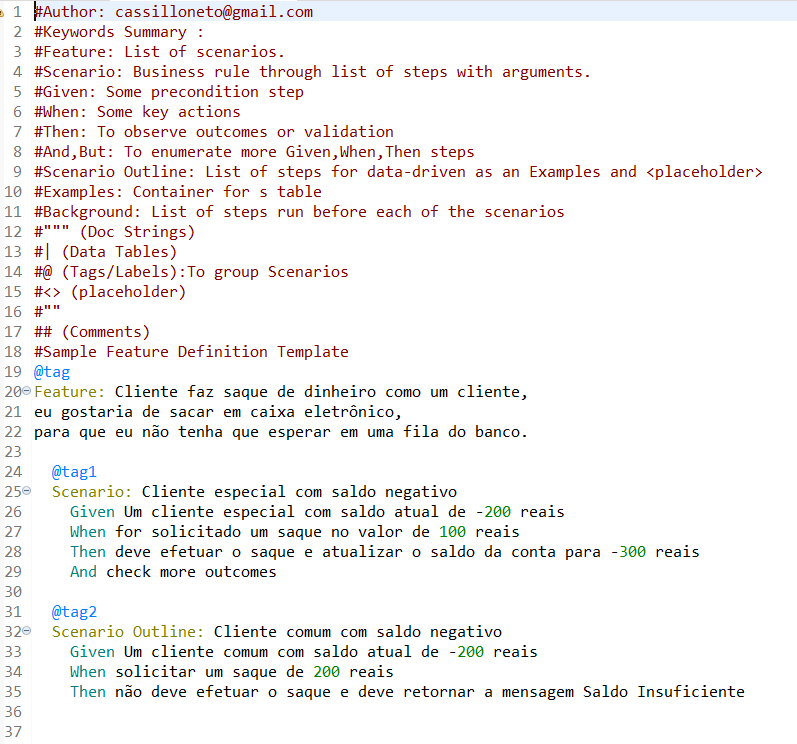

# Behavior Driven Development - CONTA BANCÁRIA
Atividade da Matéria "Qualidade e Testes de Software" onde utilizando o Cucumber deveriamos demonstrar um exemplo do dxesenvolvimento BDD.

## Descrição
O projeto simula de forma muito simples o sistema de saque de um caixa eletrônico comm condições diferentes para contas Especiais ou contas Comuns. Neste projeto foram utilizados as seguintes ferramentas:
- Java
- Maven
- Cucumber
- JUnit
- Javadoc

## Documentação Javadoc

## Cenários no Cucumber

## Resultados no Testes JUnit

## Última Atualização 01/12/2023
## Autor: Wilson Cassillo Neto
